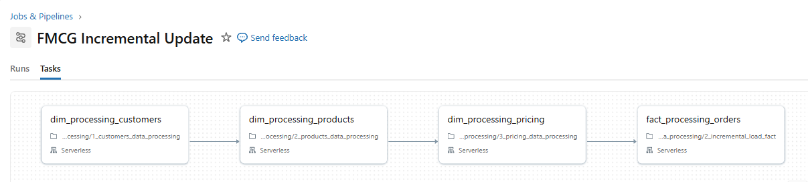

# FMCG Data Engineering and BI Project

An end-to-end FMCG sales analytics project built with Databricks notebooks, Apache Spark, Delta Lake, and a Databricks Lakeview dashboard. The project brings together parent-company sales data and child-company operational data, standardizes product and customer attributes, processes order data in full and incremental loads, and prepares a denormalized dataset for reporting.

## Project At A Glance

- **Platform:** Databricks Free Edition workspace (or a Databricks workspace with the required features and permissions)
- **Processing:** PySpark and Spark SQL
- **Storage format:** Delta tables
- **Data organization:** Bronze, silver, and gold schemas in Unity Catalog
- **Business subject:** FMCG orders, customers, products, pricing, and monthly sales
- **BI artifact:** Atlikon BI 360 Lakeview dashboard

## Architecture




The notebooks use a medallion-style flow:

1. **Bronze:** Read source CSV files and retain ingestion metadata such as read timestamp and source filename.
2. **Silver:** Clean and standardize records, remove duplicates, normalize dates, and enrich orders with product identifiers.
3. **Gold:** Publish conformed dimensions and sales facts for analytics. Incremental fact processing merges new or changed records into Delta tables.

The catalog and schema names used by default are `fmcg.bronze`, `fmcg.silver`, and `fmcg.gold`.

## Repository Layout

```text
0_data/
  1_parent_company/
    full_load/                  Parent-company dimension and fact CSV exports
    incremental_load/           Parent-company incremental fact CSV and COPY INTO SQL
  2_child_company/
    full_load/                  Customer, product, price, and daily order CSVs
    incremental_load/           Daily incremental order CSVs
1_codes/
  1_setup/                      Catalog, shared utilities, and date dimension notebooks
  2_dimension_data_processing/  Customer, product, and pricing notebooks
  3_fact_data_processing/       Full and incremental order fact notebooks
2_dashboarding/
  Atlikon BI 360.lvdash.json    Lakeview dashboard definition
  denormalise_table_query_fmcg.txt
ETL-pipeline/                   ETL pipeline diagram
resources/                      Project architecture diagram
```

## Input Data

| Source                      | Repository location                               | Data represented                                                                 |
| --------------------------- | ------------------------------------------------- | -------------------------------------------------------------------------------- |
| Parent company, full load   | `0_data/1_parent_company/full_load/`              | Customer, product, gross-price, and order exports                                |
| Parent company, incremental | `0_data/1_parent_company/incremental_load/`       | Incremental fact export and a SQL `COPY INTO` example                            |
| Child company, full load    | `0_data/2_child_company/full_load/`               | Customers, products, gross prices, and daily order files under `orders/landing/` |
| Child company, incremental  | `0_data/2_child_company/incremental_load/orders/` | Daily incremental order files                                                    |

The CSV files are provided as source data; the notebooks expect them to be available in cloud storage, not at their checked-in repository paths. See [Storage Configuration](#storage-configuration) before running the notebooks.

## Processing Notebooks

Run the notebooks in `1_codes/` from a Databricks workspace. The notebook files are exported in the Databricks notebook format and contain both code and saved cell outputs.

| Order | Notebook                                                                | Purpose                                                                                                                                                                        |
| ----- | ----------------------------------------------------------------------- | ------------------------------------------------------------------------------------------------------------------------------------------------------------------------------ |
| 1     | `1_codes/1_setup/setup_catalog.ipynb`                                   | Creates the `fmcg` catalog and the bronze, silver, and gold schemas.                                                                                                           |
| 2     | `1_codes/1_setup/dim_date_table_creation.ipynb`                         | Creates `fmcg.gold.dim_date` at monthly grain, with date key, month, year, and quarter attributes. The configured range is January 2024 through December 2025.                 |
| 3     | `1_codes/2_dimension_data_processing/1_customers_data_processing.ipynb` | Ingests, cleans, deduplicates, and standardizes customer data for the gold customer dimension.                                                                                 |
| 4     | `1_codes/2_dimension_data_processing/2_products_data_processing.ipynb`  | Cleans product attributes, corrects known text variations, and generates product codes for the gold product dimension.                                                         |
| 5     | `1_codes/2_dimension_data_processing/3_pricing_data_processing.ipynb`   | Parses pricing periods, associates prices with product codes, and prepares yearly price values for reporting.                                                                  |
| 6     | `1_codes/3_fact_data_processing/1_full_load_fact.ipynb`                 | Loads the child-company order history, standardizes dates and quantities, removes duplicates, enriches orders with product codes, and publishes the gold fact.                 |
| 7     | `1_codes/3_fact_data_processing/2_incremental_load_fact.ipynb`          | Processes incoming order files through staging and merges changes into the silver and gold fact data. It also recalculates monthly child-company aggregates for consolidation. |

Shared schema variables (`bronze`, `silver`, and `gold`) are defined in `1_codes/1_setup/utilities.ipynb` and referenced by the processing notebooks.

### Incremental Loads

The child-company incremental notebook reads CSV files from the configured orders landing directory, records file metadata, and uses Delta Lake `MERGE` operations to upsert records. The gold sales data is maintained at monthly grain for product and customer. Place each new batch in the landing location before running the notebook; check the notebook's file-movement logic and processed location before retrying a batch.

Parent-company incremental facts are handled separately. The SQL in `0_data/1_parent_company/incremental_load/incremental_data_parent_company_query.txt` uses `COPY INTO` to load `fact_orders.csv` from the Unity Catalog volume path `/Volumes/fmcg/gold/parent_incremental_data/` into `fmcg.gold.fact_orders`.

## Gold Analytics and Dashboard

The reporting query in `2_dashboarding/denormalise_table_query_fmcg.txt` creates `fmcg.gold.vw_fact_orders_enriched`. It joins the order fact with date, customer, product, and gross-price dimensions and calculates:

```text
total_amount_inr = sold_quantity * price_inr
```

The price join is based on product code and order year. The Lakeview dashboard definition in `2_dashboarding/Atlikon BI 360.lvdash.json` uses the enriched view for sales reporting, including revenue and sales breakdowns. Import the JSON dashboard into Databricks after creating the view and ensure its dataset resolves to `fmcg.gold.vw_fact_orders_enriched`.

## Setup And Run

1. Import or upload this repository's notebooks into a Databricks workspace.
2. Configure Unity Catalog access, cloud-storage access, and a Databricks Runtime that supports Spark and Delta Lake.
3. Upload the CSV files to the locations configured in the notebooks. The child dimension and fact notebooks currently reference `s3://sportsbar-final/...`; update these paths or configure the data in that bucket.
4. Run `setup_catalog.ipynb`, then bootstrap the parent-company gold data from the provided parent-company exports. The repository includes the exports and an incremental `COPY INTO` SQL example; it does not include a complete parent full-load ingestion notebook.
5. Run `dim_date_table_creation.ipynb`, then the customer, product, and pricing notebooks. The corresponding parent-company gold dimension tables must exist before child dimensions are merged into them.
6. Run `1_full_load_fact.ipynb` to initialize the child-company fact data. Ensure the parent-company fact target is initialized before its consolidation step.
7. Run `2_incremental_load_fact.ipynb` for each subsequent landing batch. The relevant dimensions and target tables must already exist.
8. Run `denormalise_table_query_fmcg.txt` in Databricks SQL, then import and open the Lakeview dashboard.

## Storage Configuration

Storage locations are embedded in the current notebook and SQL source; they are not centralized in a project configuration file:

- Child dimension and order notebooks read from `s3://sportsbar-final/`.
- The parent incremental SQL reads from `/Volumes/fmcg/gold/parent_incremental_data/fact_orders.csv`.

Before execution, either place the data at those locations and grant the Databricks compute identity access, or update the source paths to match your own cloud storage or Unity Catalog volumes. The checked-in local CSV folders are not read automatically by the notebooks. The parent incremental SQL also requires the referenced volume and target table to exist.

## Requirements

- A Databricks workspace with notebook execution, Spark, Delta Lake, and Unity Catalog support
- Permissions to create or use the `fmcg` catalog and its schemas and tables
- Read access to the configured cloud storage or Unity Catalog volumes
- The provided CSV datasets

The notebooks use Databricks-specific features such as `%sql`, `dbutils`, and Unity Catalog table operations, so they are intended to run in Databricks rather than as standalone local Python scripts.
